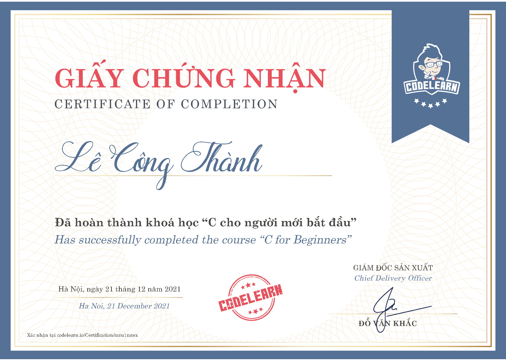
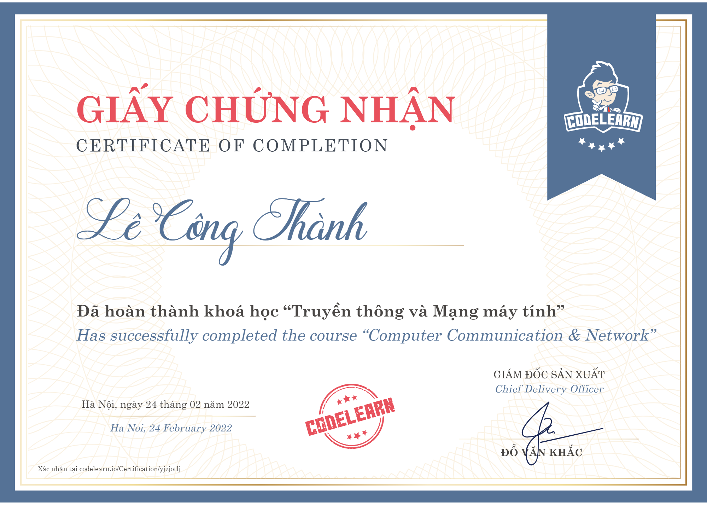
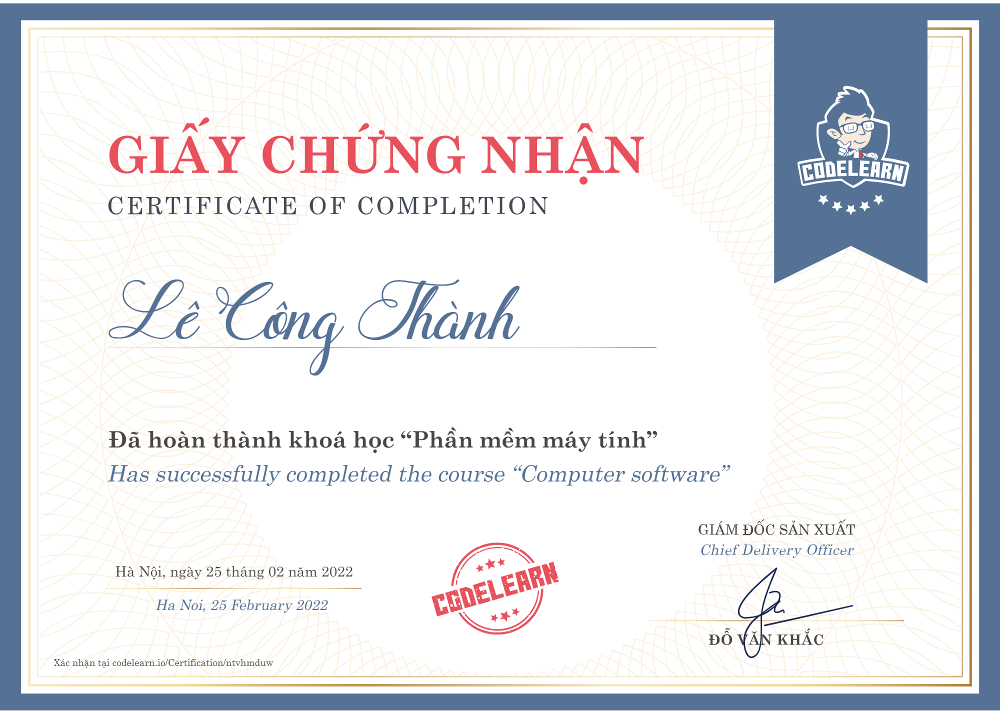

<h1 align="center">Hello wehehe, I'm Công Thành</h1>

  
  
  
  
  
  
  
  
  
  
  

<h3 align="center">An ordinary person from Vietnam </h3>

   

- ✍ I'm a student of: [Vietnam - Korea University of Information and Communication Technology](https://vku.udn.vn) (VKU).

## 📫 How to reach me:

  
   
    
   
  
  
  

## Skills:

   
  
  
  
  
  
  
  
  
  
  

<table style="width:100%;">
  <tr>
    <td>
      
      
    </td>
    <td>
      
 
  <!-- -->
        
      

    </td>
  </tr>
</table>

## 
Repository pin 📌

	

	

## 
Github Contributions 📈

 

<!-- 
# Certificates:

  
  
  
   

 -->
